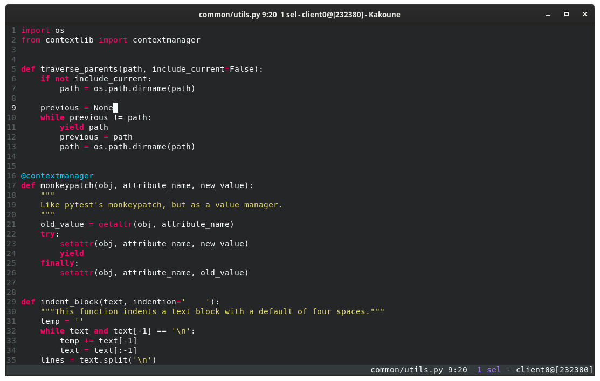

# Darkokai for [Kakoune](https://kakoune.org)
[Kakoune](https://kakoune.org) Darkokai theme based on
[sjrmanning's](https://github.com/sjrmanning/darkokai) Emacs Darkokai.

## Screenshot


## Installation
### [Plug.kak](https://github.com/andreyorst/plug.kak)
```
plug "markolenik/kakoune-darkokai-theme" domain "gitlab.com" theme config %{
    colorscheme darkokai
}
```

### Manual
Copy `colors/darkokai.kak` to `~/.config/kak/colors/`. Activate with
```
colorscheme darkokai
```
